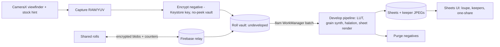

# Contact Sheet — thirty-six chances, no take-backs

Your camera roll has 23,000 photos and you can't find one you love. Contact Sheet is a camera that gives you a roll of thirty-six exposures, no preview, no retakes, no gallery — and develops your photos at eight the next morning. You load a film stock, you frame, you press the shutter, and you live with it. The screen shows you nothing but a frame counter ticking down: 14 left. And tomorrow, with your coffee, an envelope arrives: your contact sheet, the good, the blurred, the accidental masterpiece of your friend laughing a half-second before she saw the camera. Photography used to be anticipation. This is an app about wanting a picture again.

## 1. Overview
- **Elevator pitch:** A constraint-based film camera app: fixed 36-exposure rolls, no image review, no deleting, authored film-stock looks, and a development delay — rolls "come back from the lab" at 8am the next morning as a contact sheet. Premium film stocks, darkroom reprints, and physical prints/zines complete the slow-photography ritual.
- **Category:** Photography — creative tool / lifestyle.
- **Tagline:** *Thirty-six chances. No take-backs.*
- **Play Store positioning:** "The camera that makes you wait — and makes you look."

## 2. Problem & Why Now
Digital abundance broke photography's feedback loop: infinite shots → zero intention → 23,000 unloved images and the low-grade anxiety of the unreviewed roll of one's entire life. The evidence that people crave the constraint is not theoretical — it is a market: disposable film cameras returned as a Gen-Z ritual object (Fujifilm QuickSnaps sell out around events), film prices doubled and demand still grows, and the app proof-of-concept already happened: **Dispo** (David Dobrik's app) hit the top of the charts in 2021 on exactly the develop-tomorrow mechanic, then collapsed from creator scandal and an ill-fitting social-network pivot — not from a failure of the core loop. The mechanic outlived the app; nobody currently owns it done *right*: craft-first, solo-first (photos are yours, not a feed's), with film simulation treated as seriously as Fujifilm treats its recipes. Meanwhile phone cameras got so clean that "too perfect" is now the aesthetic complaint; the halation-and-grain look dominates presets and TikTok filters. The taste shift is real, durable, and underserved by anything with the discipline of an actual roll.

## 3. Target Audience & Personas
- **Ines, 24, barista and part-time photo student, Lisbon.** Shoots real film but $18/roll hurts. Contact Sheet is her sketchbook: she burns two rolls a week practicing composition, because "no preview" is precisely the muscle her teacher says to train. Buys the Stock Library sub in month two.
- **Jordan, 30, product manager, NYC.** Not a photographer — a nostalgist. Uses it at parties and trips; the 8am develop notification is the morning-after ritual his friend group now expects ("send the sheet!"). Ships a zine of his best 24 after a year (his first physical photo object ever).
- **Priya, 38, mother of two, Mumbai.** Overwhelmed by 400 near-identical photos of every birthday. One roll per family event, and *done* — the constraint is a parenting sanity feature. The annual printed pack is her holiday gift to grandparents.

## 4. Core Concept Deep-Dive
**The constraint stack is the product.** Each rule removes a specific modern anxiety, and each is enforced absolutely — configurable constraints would dissolve the point:
- **The roll (36 exposures).** Scarcity converts snapping into *choosing*. A frame counter — never images — is all you see. Loading a new roll mid-roll is possible (swap stocks for a new scene) but the old roll goes to the lab unfinished; frames are never refunded. One roll active at a time.
- **No preview, no review, no delete.** The viewfinder shows the live scene (with the stock's character subtly hinted) but after the shutter: nothing. No thumbnail, no "did I get it." This is the app's spine and its hardest discipline; it is also what makes the development moment *land*.
- **The development delay.** Rolls sent to the lab develop at **8:00 the next morning** (finish a roll before 8pm; after that it joins the following morning — one batch a day, like a real one-hour lab that closed). The delay is non-skippable in the base app, and — critically — even paid tiers only shorten it to same-evening, never instant: the wait is the moat and the message. The develop notification is the product's heartbeat: "Your roll is back. 36 exposures, October 14."
- **Film stocks as authored looks.** Not filters — *stocks*, with the depth of Fuji recipes: each defined by a color-response curve (per-channel LUT), grain structure (size/roughness/chroma vs. luma placement), halation response (highlight bloom with red-edge bleed), dynamic-range behavior (how highlights roll off), and quirks (one stock light-leaks on frames 1 and 36; the cheap "Corner Store 400" occasionally underexposes — its charm is stated on the box). Launch stocks (all original, legally clean, lovingly named): **Meridian 100** (honest daylight color), **Corner Store 400** (warm consumer nostalgia), **Nightbus 1600** (grainy tungsten push), **Gullwing B&W** (classic silver), **Riviera 50** (saturated vacation chrome), **Statik** (expired-roll roulette: shifts unpredictable per frame). Choosing a stock *before* the scene is the photographic act of intention the app teaches.
- **The contact sheet.** Development delivers the roll as a true contact sheet: 6×6 grid, frame numbers, stock name, date span, sprocket-hole chrome. You review with a **loupe** (press-and-hold magnifier gliding over frames — the gesture is pure darkroom), mark **keepers** with a grease-pencil circle animation, and choose at most **one frame per roll to share** natively (the Frame export — beautiful bordered image with stock/date colophon). The one-share rule keeps the app photography-first and accidentally makes every shared frame precious (and the colophon markets the app).

**The darkroom (premium)** extends the ritual without breaking the rules: **push/pull processing** decided *at development time for the whole roll* (real-film logic: +1 push = brighter, grainier, crunchier — chosen blind, before you've seen the frames, exactly like handing instructions to the lab), **reprints** (re-develop any past roll onto a different stock — one per roll), and **dodge & burn** on keepers only, with hand-tool physics rather than sliders. No cropping ever. You frame when you shoot.

**What it is not:** a social network. No feed, no follows, no likes. Dispo died on that hill correctly. Sharing happens outside (the Frame export, the "send the sheet" group-chat behavior), where photography's social life actually lives.

## 5. Complete Feature Set
**MVP (v1.0):**
- Camera: stock-hinted live viewfinder, exposure tap, flash toggle, frame counter, roll loading with stock picker; shutter feel tuned (sound + haptic + a mechanical wind-on drag before the next shot is ready — 1.2 seconds that change everything about pacing).
- The lab: 8am batch development, develop notifications, unfinished-roll handling.
- Contact sheets: grid, loupe, keepers, one-frame share with colophon; sheet archive by month.
- 3 free stocks (Meridian 100, Corner Store 400, Gullwing B&W); roll history; full-resolution keeper export to system gallery (your photos are never hostages — but export happens *after* development, always).
- Offline-complete: shooting, developing, everything (the "lab" is local; the delay is a scheduled local job).
**v1.x fast-follows:**
- Stock Library subscription stocks (Nightbus, Riviera, Statik + monthly drops); darkroom (push/pull, reprints, dodge & burn).
- Shared rolls: one roll, several friends' phones, shooting the same 36 at a party/wedding — everyone gets the sheet at 8am (the killer group feature; invite-link based, no accounts beyond a display name).
- Double exposures (advance-lever long-press), self-timer, distance-scale zone focus mode (teaches real technique).
**v2.0+:**
- Print service: 4×6 packs of keepers, the Annual Box (your year's best 100 as prints in a clamshell), and the **Zine builder** (pick 16–32 frames, auto-layout with your sheet dates, saddle-stitched object shipped worldwide).
- Stock Foundry: community-designed stocks via a parameter kit, curated seasonal graduations into the library (creator rev-share).
- "Expired mode" for any owned stock (age it: shifted colors, fog) and bulk-load "cinema rolls" (24 exposures, cinematic LUT lineage).

## 6. Screen-by-Screen UX Walkthrough
Navigation: three surfaces — **Camera**, **Sheets**, **Stocks/Shop** — swipe-adjacent, camera always default on launch (a camera app that opens to anything else has failed).
- **Camera:** full-bleed viewfinder; top strip: stock name + frames left ("CORNER STORE 400 · 14"); bottom: shutter, flash, stock/roll button. Loading a roll is a deliberate two-step with a cartridge-drop animation and the wind-on ratchet — the ritual is the tutorial.
- **Roll-done moment:** frame 36 fires → the motor-rewind sound plays → "Roll sent to the lab. Back tomorrow, 8am." → camera sits empty until you load the next (an *empty camera* state is a real state; it makes loading intentional).
- **Sheets:** archive of contact sheets, newest first, each a physical object on a light-table surface; badge on undeveloped rolls ("at the lab"). Sheet view: the grid, loupe on press, keeper circling, share-one flow, darkroom entry (premium).
- **Stocks/Shop:** the stock shelf as boxes with beautiful packaging design (the boxes are collectible UI; long-press flips the box for the data-sheet: curve, grain, quirks — honest spec-sheet romance); subscription state; print/zine entry points (v2).
- **Settings (minimal):** develop-notification time (8am default, adjustable ±2h — parents of newborns asked), shutter sound options (never fully silent — accountability is part of the covenant, except where law/context demands; a discreet mode exists but stamps "DISCREET" on the sheet's margin. Honesty, with a sense of humor).
**Key flow — first roll (onboarding is a roll):** install → one screen of covenant ("36 shots. No preview. Tomorrow at 8. Trust us once.") → load Meridian 100 (guided, ratchet sound) → shoot; at frames 30/33/36 the counter gently glows → rewind moment → the *wait* (the app does nothing overnight — the restraint IS the onboarding) → 8am notification → first sheet + a one-time overlay teaching loupe and keepers → the share-one moment. Day-2 retention is the whole funnel here, by design and by KPI.
**Key flow — the wedding shared roll (v1.x):** host creates "Nadia's Wedding — Riviera 50, 36 frames" → QR on tables joins guests → every phone shoots into the same dwindling counter (the scarcity gets *social and funny* — "who burned six frames on the cake??") → 8am: everyone wakes to the same sheet. This flow converts entire friend groups per event and is the growth engine's core.

## 7. Design Language
Lab-counter modernism: warm gray light-table surfaces, film-box color pops per stock, sprocket and frame-number chrome used sparingly and accurately (real 135 film geometry — enthusiasts notice). Type: a grotesk with character (Archivo tuned tight) in all-caps for stock names, tabular numerals for counters. Motion: mechanical honesty — ratchets, drops, the rewind; nothing floats or bounces; the loupe glides with mass. Sound: the app's soul — a shutter with body, the wind-on, the motor rewind, the envelope slide of a sheet opening; recorded from real cameras, mixed subtle. Haptics mirror the mechanics. The aesthetic never cosplays skeuomorphic leather; it is a modern instrument that respects an old ritual.

## 8. Technical Architecture
Opinionated stack: **Kotlin + Jetpack Compose**, camera via **CameraX** (broad device sanity) with a custom capture pipeline: shoot RAW (or highest-quality YUV where RAW unavailable), then *immediately encrypt and vault* the negative — undeveloped frames are stored AES-encrypted with a key held in Android Keystore, unreadable by design until develop time (the no-peeking covenant enforced technically; even the developer can't peek — publishable claim, verifiable in the APK). Development is an on-device batch job (WorkManager, scheduled for the 8am window): decrypt → run the stock's pipeline (LUT → grain synthesis seeded per-frame → halation pass → paper rendering to the sheet) → write keeper-eligible full-res JPEGs + the sheet composite → purge negatives. GPU via RenderEffect/AGSL shaders; the grain must be structural (resolution-independent synthesis), not an overlay asset. No backend for the core loop; shared rolls (v1.x) use **Firebase** (anon auth, roll membership, frame-count consensus, and encrypted-blob relay — frames develop locally on every member's device from synced negatives at 8am *their* time; the lab is still local). Stocks are parameter packs (versioned, signed) — the Foundry (v2) emits the same format.

## 9. Data Model
- **Roll:** `id`, `stock_id`, `frames_total{36}`, `frames_shot`, `state{loaded|at_lab|developed}`, `loaded_at`, `develop_at`, `push_pull{-1|0|+1}?`, `shared_roll_ref?`.
- **Negative (transient, encrypted):** `roll_id`, `frame_no`, `blob_ref`, `exif{time, flash, orientation}`, `grain_seed`.
- **Sheet:** `roll_id`, `composite_ref`, `developed_at`, `stock_id`, `date_span`.
- **Frame (developed):** `roll_id`, `frame_no`, `image_ref`, `keeper:bool`, `shared:bool`, `reprint_of?`.
- **Stock (content pack):** `id`, `name`, `iso`, `curve_lut_ref`, `grain{size, rough, chroma_mix}`, `halation{threshold, bleed}`, `quirks[{light_leak_frames, underexpose_p, shift_random}]`, `box_art_ref`, `tier{free|library}`.
- **SharedRoll:** `id`, `name`, `stock_id`, `member_ids[]`, `frames_claimed{member: count}`, `state`.
- **Order (v2):** `type{prints|annual|zine}`, `frame_refs[]`, `layout_ref?`, `status`, `fulfillment`.

## 10. Monetization
Hybrid: one-time base + a content subscription that maps to film's actual economics + physical goods. **Free:** everything in MVP with 3 stocks and 2 rolls/week (a real constraint that fits the philosophy — film was never free; heavy shooters feel it honestly). **Contact Sheet Plus — one-time $7.99** (₹399): unlimited rolls, develop-time push/pull, double exposures, same-evening development option (7pm — never instant), full-res exports unrestricted. **The Stock Library — $2.49/month or $19.99/year:** all premium stocks + a genuinely crafted monthly stock drop (each with box art, spec sheet, and a 90-second "why this look" note — the drop is content marketing and retention in one), reprints, dodge & burn. **Physical:** print packs (~$12), Annual Box (~$49), Zines (~$29+) at healthy print-on-demand margins. Conversion logic: the 2-roll cap converts party users on Saturday #3; the Library converts look-collectors via drop cadence that is, for once, aligned with craft; physical goods convert the emotionally invested at gift moments (prompted only post-keeper-marking, never cold). Targets: 6% to Plus in 60 days; 30% of Plus into Library within 6 months; print attach 8% of year-one actives. No ads (an ad interrupting the 8am envelope is unthinkable).

## 11. Play Store Listing
- **Title (≤30):** `Contact Sheet: 36 Exposures` (27)
- **Short description (≤80):** `36 shots. No preview. Your roll develops tomorrow at 8am.` (57)
- **Full description:** open with the 23,000-photos indictment; blocks: Load a Roll (stocks with character, spec-sheet romance), Shoot Blind (the covenant, the wind-on), Tomorrow at Eight (the ritual, the sheet, the loupe), The Darkroom (push/pull, reprints), Together on One Roll (shared rolls), Paper at Last (prints/zines). Close with the no-social statement: "No feed. No followers. Photography."
- **ASO keywords:** film camera app, disposable camera app, dispo alternative, vintage camera, film grain camera, analog photography, 35mm look, delayed photos, retro camera, film simulation.
- **Content rating:** Everyone (camera; user's own content; shared rolls are private groups → UGC declaration with report/leave mechanics).
- **Policy notes:** photos remain on-device (Data safety: no collection for core app; shared-roll blobs E2E-relayed and documented); camera/mic permissions contextual; the encrypted-vault "even we can't see undeveloped frames" claim must be technically accurate (it is — key never leaves Keystore); shutter-sound compliance per-region (Japan/Korea legal requirements override discreet mode via locale detection).

## 12. Growth & Marketing Plan
The mechanic markets itself if the 8am moment is protected; the plan amplifies the moments it creates. (1) The Frame colophon: every shared keeper carries stock name + "developed 8:04am" — a mystery hook in every group chat (measure colophon-attributed installs via the share card's subtle link). (2) Shared rolls as event-virality: wedding/party templates, QR table cards (printable kit), and a "roll host" content angle for event photographers and creators — one wedding = 40 installs with a built-in payoff next morning. (3) The Dispo diaspora: the audience that loved the mechanic and lost the app is findable (r/analog, film-TikTok); the pitch is explicitly "the mechanic, grown up, no feed." (4) Film-community credibility: collaborate with respected film YouTubers on a stock design each — their recipe, their name in the box-art credits, their video the launch asset. (5) Drops as ongoing PR: each monthly stock is a small cultural object (Nightbus 1600's box says "for the last train home") — screenshot-native, moodboard-friendly. (6) Seasonal physical pushes: Annual Box in November, Zine builder at graduation season. The app never asks for reviews except once, the morning after a user marks 5+ keepers on one sheet — the happiest possible moment.

## 13. Analytics & KPIs
North star: **rolls developed per active user per month** (target ≥ 3 by month 2 — the ritual repeating). Key events: `roll_loaded{stock}`, `frame_shot{frames_left}`, `roll_completed{hours_to_finish}`, `develop_notification_opened{minutes_to_open}`, `loupe_used`, `keepers_marked{count}`, `frame_shared`, `shared_roll_created/joined{size}`, `plus_purchased{trigger}`, `library_started{trigger}`, `print_ordered{type}`. Health thresholds: D1 ≥ 55% (the 8am notification must pull them back — this number *is* the product verdict); develop-notification open ≥ 70% within 3 hours; median frames-per-day pacing 6–12 (faster = mindless, slower = abandoned; both inform stock/counter tuning); share-one usage ≥ 35% of sheets; free→Plus ≥ 6%; keeper rate 15–30% of frames (the constraint is teaching selection — track its drift over user lifetime as the *pedagogy metric*: veterans should keep more of fewer).

## 14. Risks & Mitigations
- **Day-2 cliff (users won't wait):** the covenant screen sets the contract before the first shot; the first develop notification is crafted like a gift (custom sound: envelope slide); and the free tier's loop (shoot today, joy tomorrow, repeat) is short enough to habituate. If beta D1 < 45%, the response is better ritual — never a shorter delay; the delay is load-bearing.
- **"Just use a filter app" reductionism:** the moat is the constraint system + the vault honesty + sound/feel craft; marketing never argues with filter apps, it demonstrates mornings.
- **Dispo association (scandal residue):** no influencers as founders, craft-first brand, and the explicit no-feed stance; the association fades where the product diverges.
- **Camera-quality expectations on low-end devices:** stocks are forgiving by nature (grain flatters noise); CameraX device-tier profiles; honest min-spec.
- **The one-share rule frustrating power users:** full-res keepers export freely to the system gallery post-development — the rule governs *in-app native share* only; the distinction is explained once, in the sheet tutorial.
- **Play policy:** shutter-sound law compliance by locale; vault claim accuracy audited each release; shared-roll UGC report/leave flows from day one.

## 15. Competitive Landscape
- **Dispo:** the proof and the cautionary tale — mechanic validated at #1 App Store scale; died of creator scandal + feed pivot + Android neglect. Contact Sheet is the mechanic with craft depth, solo-first posture, and Android-native excellence.
- **Huji Cam / 1998 Cam / Old Roll:** filter-nostalgia cameras, instant gratification, zero constraint; huge installs, shallow retention; they own "the look," Contact Sheet owns "the ritual" (and does the look better via structural grain).
- **Fujifilm X-series recipe culture / real film:** not apps — the culture Contact Sheet borrows credibility from; real-film shooters are advocates, not competitors (Ines uses both; the app is film's gateway and sketchbook).
- **VSCO:** preset empire with a social layer; editing-after-the-fact philosophy — the exact opposite decision architecture; different muscle entirely.
- **Lapse (invite-viral "darkroom" camera):** the closest living competitor — develop-delay plus social feed, growth-hacked invites; its feed-first identity and aggressive onboarding are the differentiation surface: Contact Sheet is the quiet, craft, no-feed alternative for people who bounced off Lapse's pushiness (a documented, sizable cohort in its reviews).

## 16. Development Plan
Solo dev, ~20 weeks to v1.0. W1–3: capture pipeline + encrypted vault + the develop batch job skeleton (the covenant works end-to-end with a passthrough "develop"). W4–7: the stock engine — LUT infrastructure, structural grain synthesis (the hard, differentiating render science; budget a full month), halation; Meridian + Corner Store + Gullwing authored and tuned against reference film scans. W8–9: contact-sheet renderer, loupe, keepers, share-one with colophon. W10–11: camera UX polish — sounds recorded (rent real cameras), wind-on pacing, roll load/rewind rituals, empty-camera state. W12–13: notifications, archive, settings, exports, 2-roll cap + Plus IAP. W14–16: closed beta (400 users, deliberately half "party people" half photographers); the D1 and notification-open numbers decide everything; iterate ritual craft. W17–18: store assets, the launch film (a 60-second morning: alarm, coffee, envelope slide, one kept frame — no UI until second 45), creator stock collabs begin. W19–20: buffer + launch. Library + darkroom: 8 weeks post-launch; shared rolls: the quarter after (the growth feature ships when the core ritual's numbers prove the foundation). **If behind:** cut push/pull and double exposures from v1.x scope, ship 3 stocks — never cut the vault, the delay, or the sounds.

## 17. Moonshots
- **The Lab, physical:** partner with real photo labs so a roll can be optionally *printed before you see it* — the sheet arrives at 8am and the 4×6s arrive Thursday; you see some frames on paper first, like your parents did.
- **One-Roll Assignments:** monthly themed rolls judged blind by a guest photographer (shoot "thresholds" on Gullwing; 36 frames, one submission) — a photography school disguised as a game, no feed required.
- **Stock provenance engine:** scan a real negative strip's rebate edge to "clone" a beloved actual roll's character into a personal stock (computational film archaeology; press writes itself).
- **The family camera:** a shared household roll that develops on Sunday — a week of family life on one sheet, the fridge-door artifact revived (prints subscription attached).
- **Hardware flirtation:** a minimal Bluetooth shutter-grip with a wind-on lever and frame-counter e-ink window — the app's ritual made tactile; small-batch, Teenage-Engineering-adjacent object energy.
